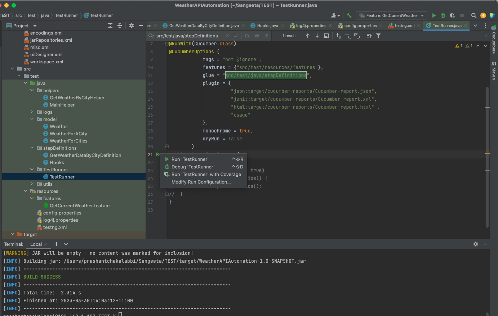
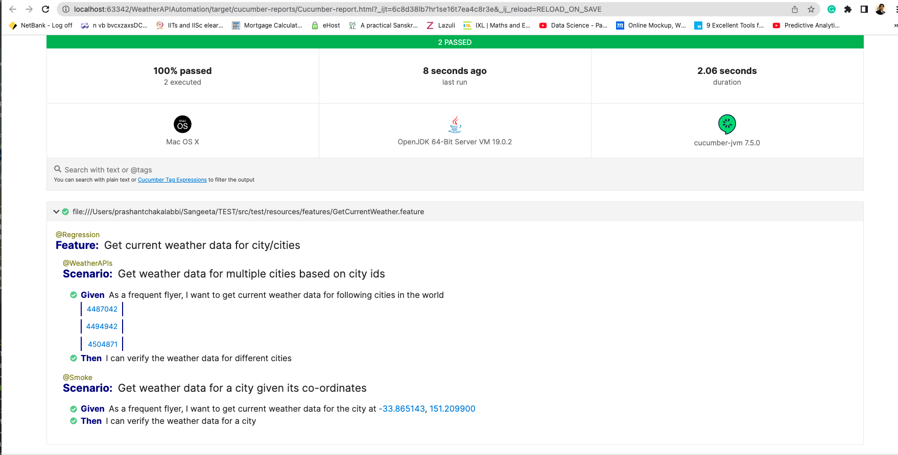
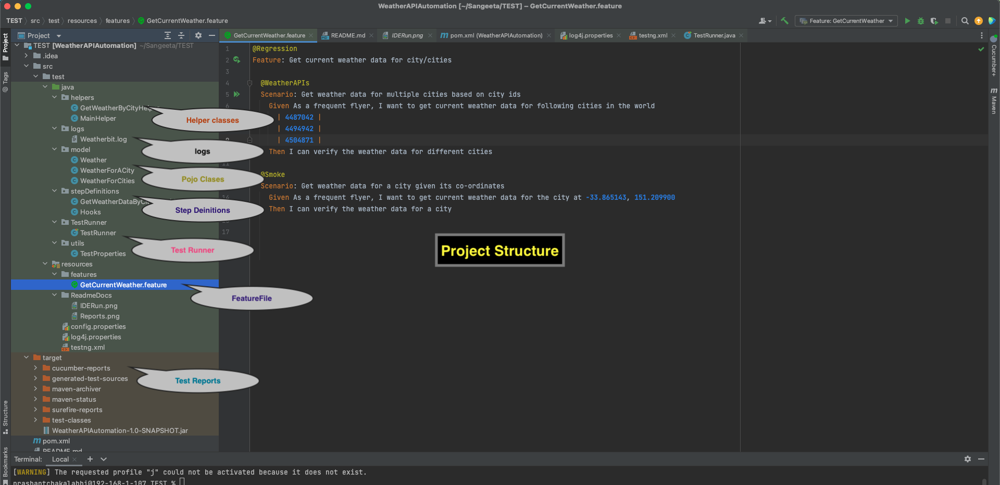

# Project:
This framework tests weather conditions using Rest APIs.

## Frameworks, Libraries and Tools and Frameworks used
```
* RestAssured test framework
* BDD cucumber
* Maven build
* TestNG integration
* Cucumber Json reports
* log4j 
```
## git Repo
```
git clone https://github.com/sangeeta-chakalabbi/WeatherAPIAutomation.git
```

## Prerequisites Installations in your development Environment / IDE:
```
* JAVA 1.8 - Install Java and set the JAVA_HOME path on your machine.
* Rest Assured library
* Logging
* Maven
* Cucumber 
* lombok
* TestNG
```
## How This Framework Works:
```
1.  The test Scenarios are captured using BDD way under feature files
2.  And then there are classes that implement or define each of the steps in feature files 
3.  In order to store JSON response and validate data, the test uses POJO classes, 
    that provide built in getters and setters needed by assertions of various fields of the Response.
4.  The actual APIs themselves are invoked using RESTAssured library calls such as given(), when(), then() etc
```


## Ways to invoke the tests
1. From ide you can invoke the TestRunner file which has links to feature file and the corresponding step definition.
'TestRunner'


2. Or on indivisual scenarios you could right click and run

3. **mvn command line**
```
    mvn clean verify -PRegression
    mvn clean verify -PSmoke
    mvn clean verify -PWeatherbitio
```


## Reporting and Logging
**Reporting Path**
```
./target/report/cucumber-html-reports/
```


**Logging Path**
```
./src/test/java/logs/ApplicationLog
```
## Project Structure


## Assumptions
- Since we are covering just the happy paths at the moment. 
- The assumption is that API does not fail and comes back with data everytime


## Happy Paths

```
1. As a frequent flyer, I want to get current weather data for following cities in the world
2. As a frequent flyer, I want to get current weather data for the city at -33.865143, 151.209900
```


## Error Prone Scenarios

```
1. API may fail to return data
```

## Challenges faced and solutions

```
1.  To come up with Step definitions and Helpers which can be re-used
2.  Efficient way of storing input data and test data during execution
```

## Documentation at

*https://github.com/sangeeta-chakalabbi/WeatherAPIAutomation*

## **Future Roadmap**

```
1.  To run tests in Parallel by using cucumber testNG options. And using TestNG xml file in pom build 
    Sample code snippet which could be placed in TestRunner
    
    import cucumber.api.testng.AbstractTestNGCucumberTests;
    
    public class TestRunner extends AbstractTestNGCucumberTests {
	@Override
	@DataProvider(parallel = true)
	public Object[][] scenarios() {
		return super.scenarios();
	}
    } 

2.  Include negative and edge case scenario

3.  Incorporate methods to check most of the JSON response using lesser lines of code.
    For instance, use of libraries such as **jsonassert** 
```


